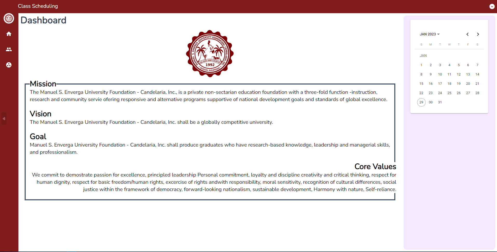
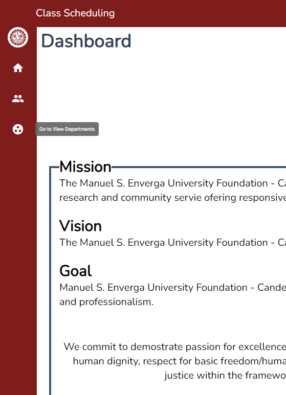
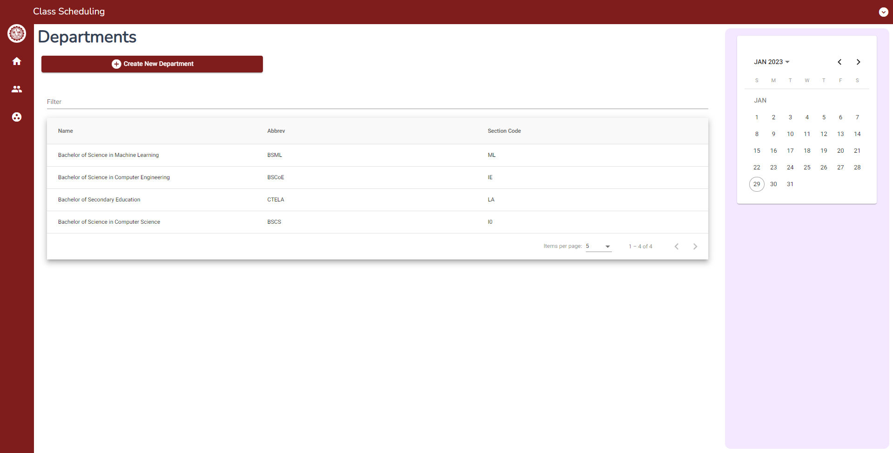
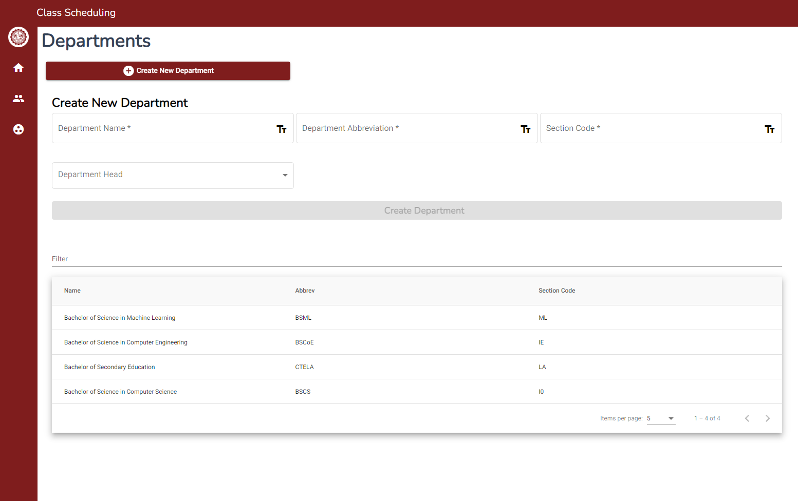

# Creating a new Department

## Navigating around the system

This tutorial shows you how use the **Class Scheduling System** to create a new deparment.
Once you login, you'll be redirected to the dashboard page of the system that will look like in that image shown.

Using the left navigation bar, select the bottom icon to go to the departments page.

## Departments Page

Once you navigate to the departments pages, you'll be shown with a page similar to the image shown.

## Creating the new department

Once you've navigated to the departments page. You'll see a button on the screen that shows **Create New Department**
You can click that button to show that field that you need to fill up to create a new department similar to the image shown.

Once you can see the fields, fill up all the fields then click the **Create Deparment** button to create a button.
Once that department is created, you can see that department in the table.