# Creating New Class Schedule

!!! note annotate "Note"
    This operation is for department heads only.

    This operation is also used when you're trying to creating the class itself (e.g., BSCS-1)

    If you just want to add subjects to an existing class, please use the guide for editing an existing class schedule

## Navigating around the system

This tutorial shows you how use the **Class Scheduling System** to create a new deparment.
Once you login, you'll be redirected to the dashboard page of the system that will look like in that image shown.

Using the left navigation bar, select the bottom icon to go to the schedules options page.
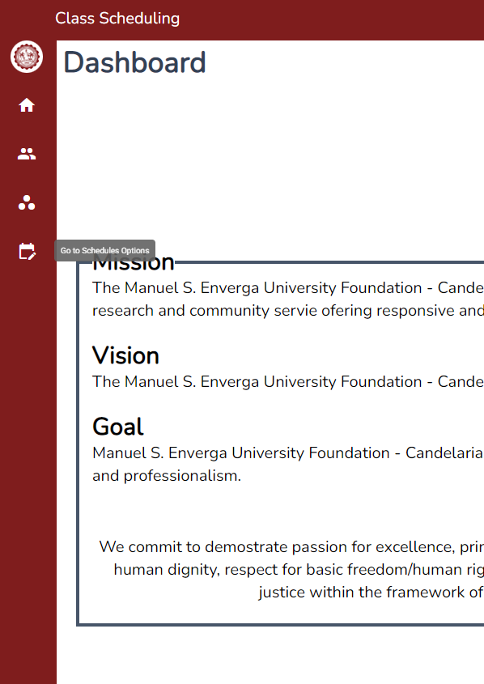

## Schedules Page

Once you navigate to the schedules pages, you'll be shown with a page similar to the image shown.

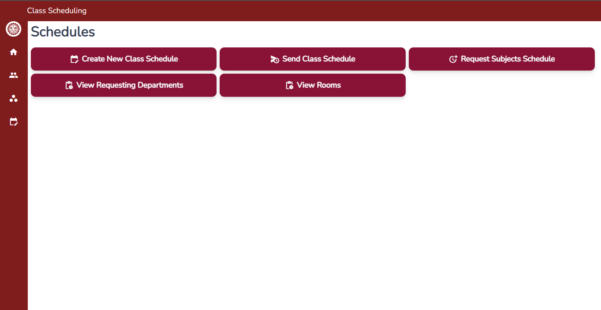

## Creating the class schedule

Once you've navigated to the schedules page. You'll see a button on the screen that shows **Create New Class Schedule**
You can click that button and you'll be navigate to a new page similar to the image show.

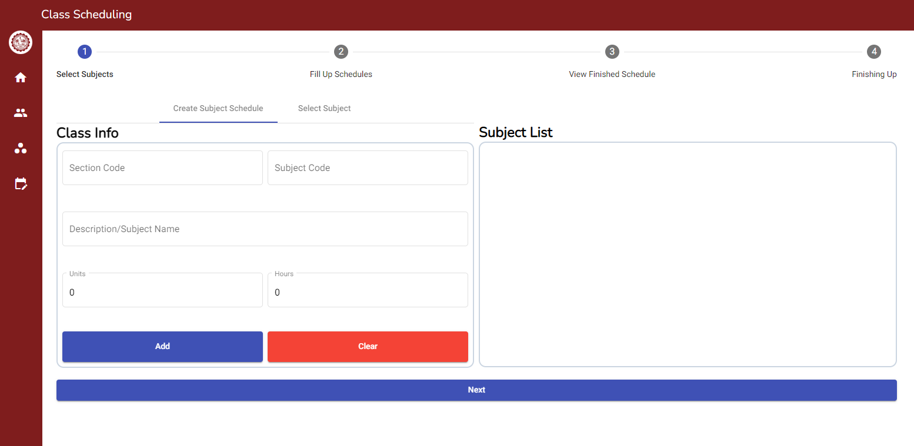

## Adding new Subject

Once you're in a page similar in the image above. You'll see a sectiont that states **Class Info**.

In that section, you can see fields and buttons. Fill out the fields according to the labels inside them.

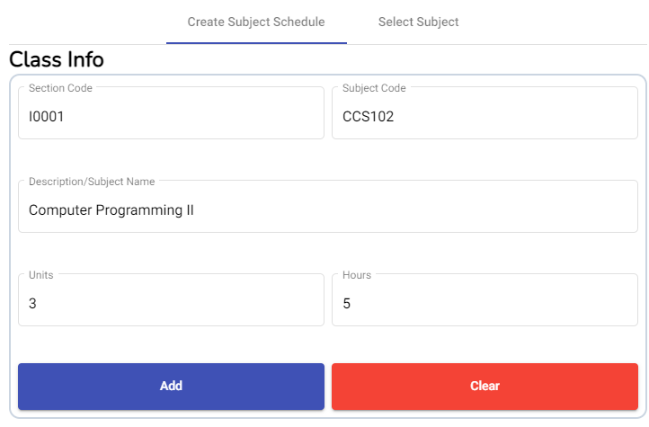

Once you filled up all the field, you can click the button **Add** to add the class subject to the list.

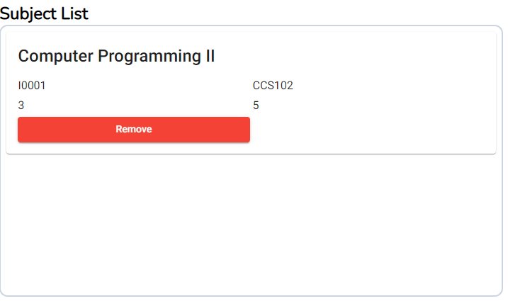

In case you want to include a subject that comes from a difference department(e.g., GE Subjects). Click that **Select Subject** tab that is beside **Create Subject Schedule** tab.

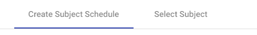

After clicking the **Select Subject** tab, you'll see the section change to something similar to the image.

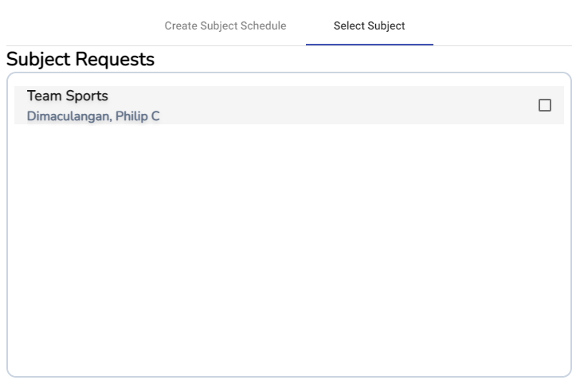

You'll see the list of subject from different department that you are able to add you're department classes.

You can select subjects by clicking the checkbox of the subject that you wish to add to the class schedule that you're trying to create.

After filling out all the subject list that you wish to add. Click that **Next** button on the bottom part of the page.

!!! note annotation "Note"

    In case that you don't have subject from different department, you can send them a request of subject list.

    Please refer to the guide named **Requesting subject from a different department** for a walkthrough on how to do it.

## Adding schedules for the subjects

Once you click next, you'll see a page similar to the image shown in the bottom.

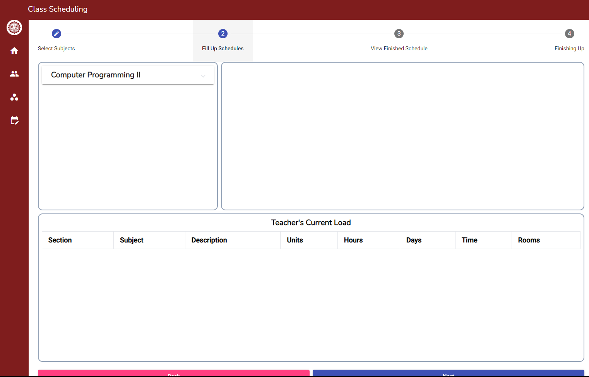

Click the subject you wish to add schedule in left side of the selection.

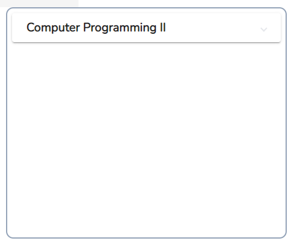

After clicking the subject you wish to edit. You'll see a new section pop up similar to the image shown below.

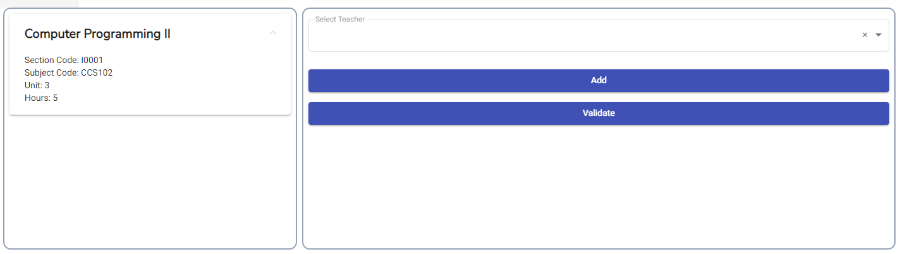

After that, click the **Select Teacher** field to select that teacher you wish to assign to the subject that you selected.

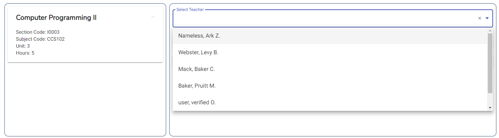

Once you've selected the teacher you wish to assign to the subject that you've selected. Section will be populated with something similar to the image show below.

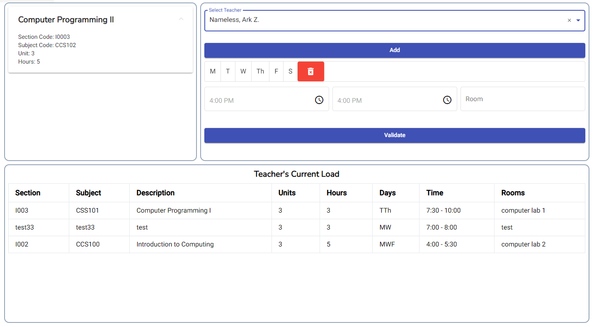

!!! note annotation "Note"
    The image shown below is the section corresponds to the schedule that you wish to create.

    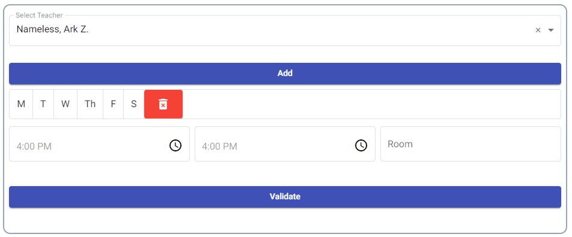

    While the image shown below is the section in which the current teacher's subject loads are shown. 

    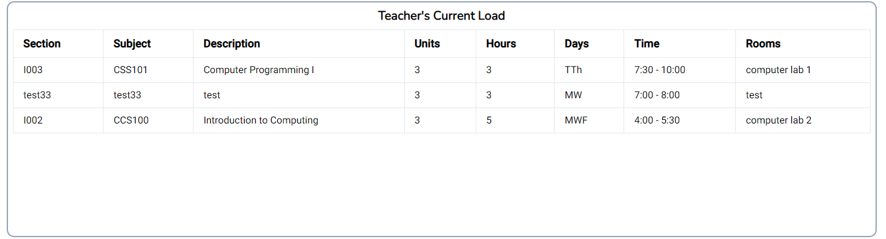

After selecting the teacher you wish to assign to the subject. Select(click) the days of the subject using this selection.

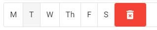

After selecting the days, click the *left* time for start time, and the *right* time for the end time.

!!! note annotation "Note"
    When you click the time selector, you'll see something similar to the image below.
    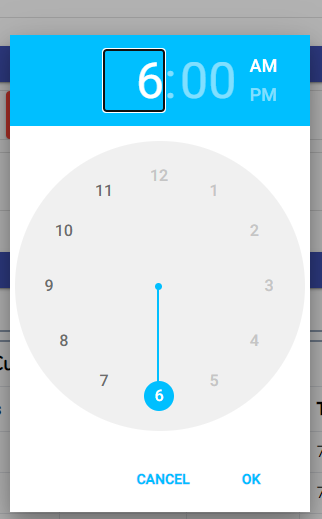

    You can then navigate the time you wish to assign using the widget by clicking the clock and am/pm.

After filling out the time of the subject schedule, you can also assign the room where the subject class will be conducted. Please click the magnifying glass icon in the field to show the currently registered schedule in the class.

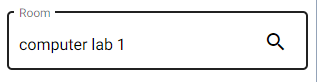

Once you click the magnifying glass, you'll see a tabs of days and a list of subject schedules assigned in that room that you've searched.

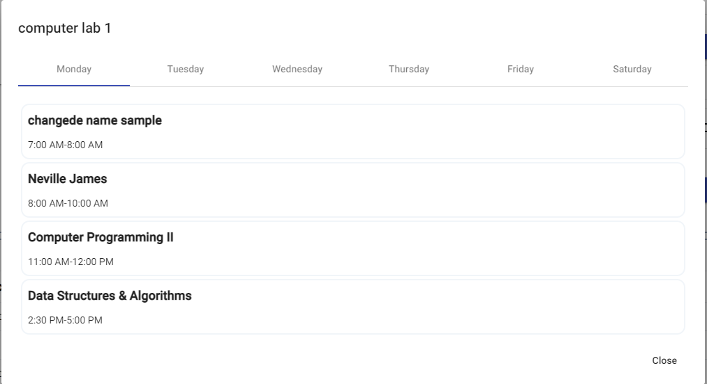

!!! info annotation "Info"
    In a situation that you want to make a schedule that have different days and time schedule, you can click the **Add** button in the schedule section to add new day schedule for the subject.

    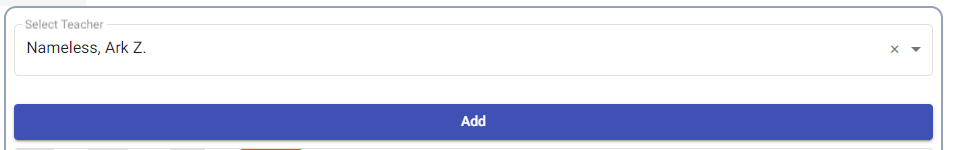

    Once you click the **Add** button, a new set of fields will be added which is different to the schedule that you've already filled up.(the button part of the fields)

    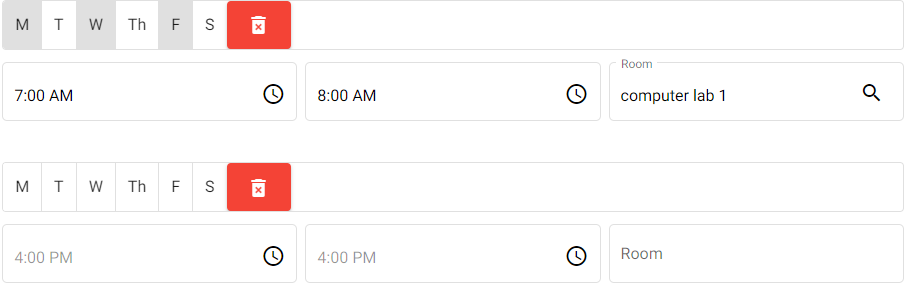

    Once you can see the new set of fields, you can continue to do the similar steps from selecting days.

    Subsequently, you can click the red trash bin to remove the days schedule.

    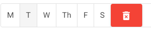

Once you're satisfied to the schedule that you've created, click the **Validate** button to see if the schedule is valid.(Doesn't have conflict)

If you click the **Validate** button and showed a message in the bottom of the page that says **Invalid Schedule**, read the rest of the message to know the error.

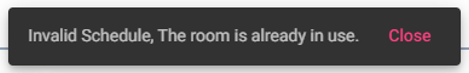

Then, you if the message box shows a message **Congrats! it's a valid schedule.**. You can proceed to click another subject that you've added and just the repeat the process that you've done since **Selecting Teacher**.

!!! danger annotation "Warning!!!"
    Please **always** validate the schedule and don't proceed to next page until you see the congrats message box to prevent system error on the schedules.

After the congrats message, click the **Next** button to proceed to the next page.

After click the **Next** button, you'll see the page change to something similar to the image below.

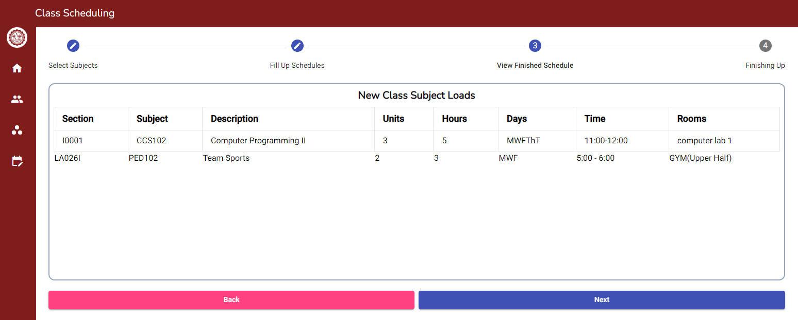

This stage shows the table of subject schedules that you've created.

If you're satisfied with the class schedule that you've created, click **Next** to proceed to the next stage.

After click the **Next** button, you'll see a page similar to the image below.

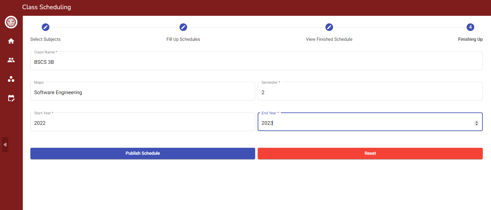

The fields are already filled up, please follow something similar to image above based on you're department and year and section of the class schedule that you're trying to make.

After you filled out the fields in this section, click the **Publish Schedule** button to publish the schedule.

After you clicked the **Publish Schedule** button, wait for the message at the bottom of the page saying something similar to the image shown below.

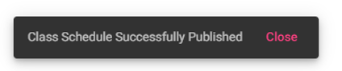

After that message, you can navigate to you're classes page using the left navigation bar to view the schedule and perform operation you wish to do with it.
